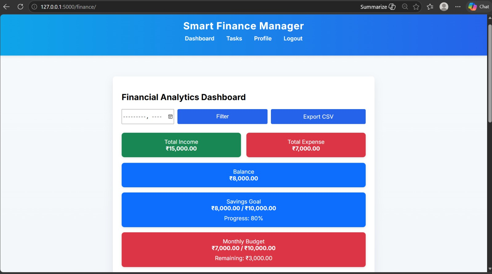
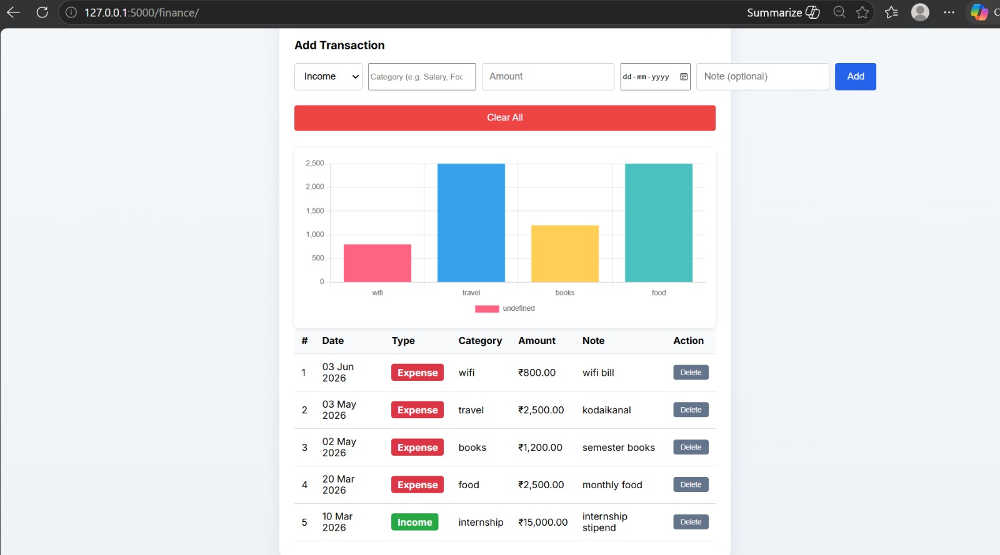
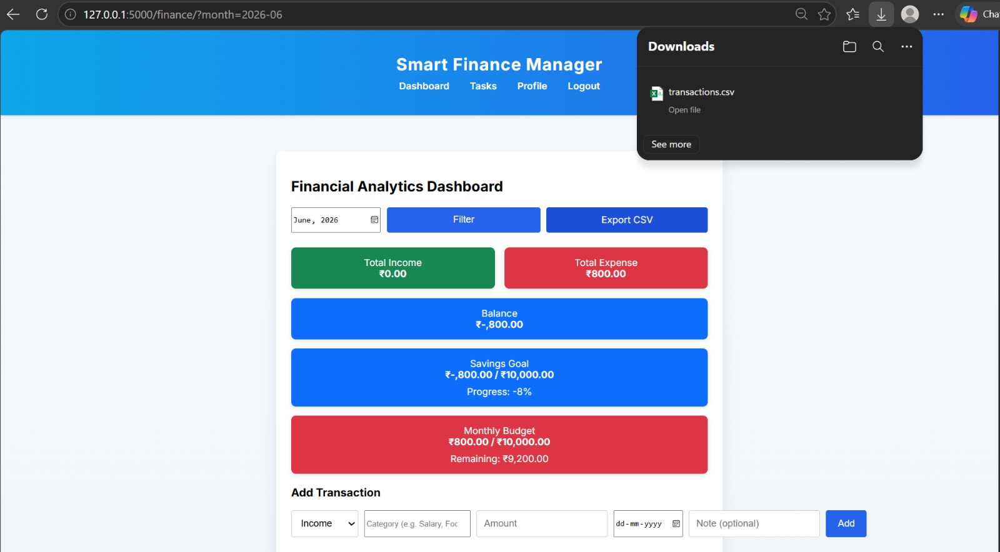
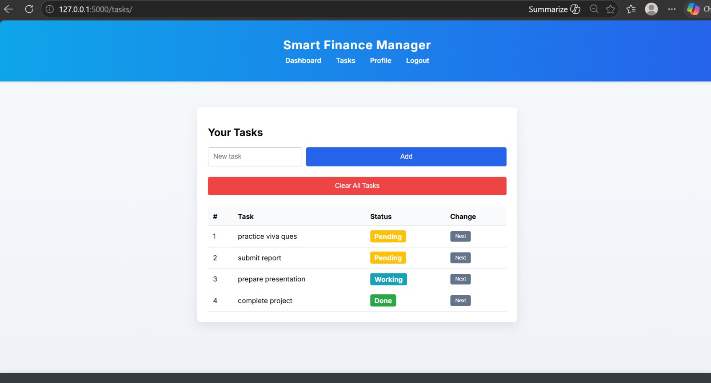
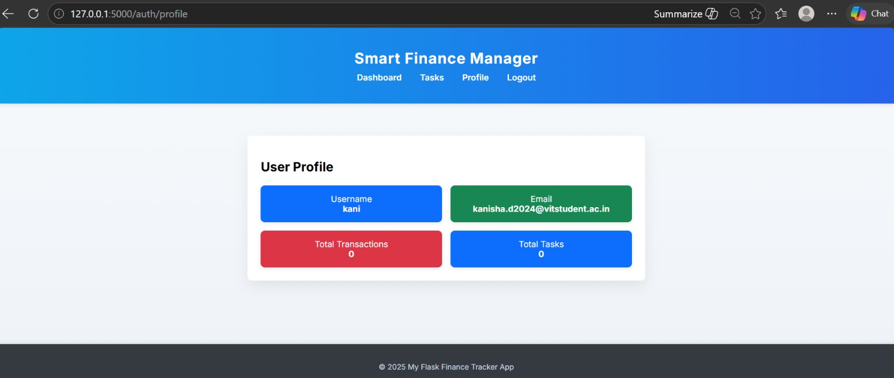
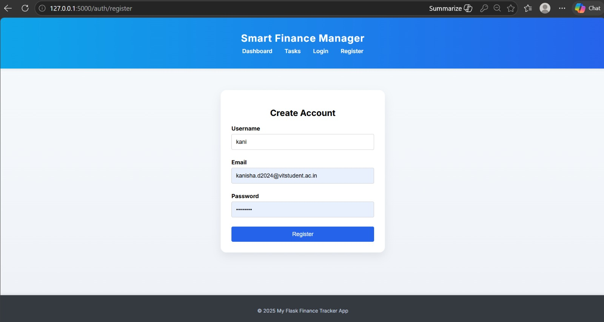

# Smart Finance Manager

## Overview

Smart Finance Manager is a Flask-based web application designed to help users manage their personal finances efficiently. The system allows users to track income and expenses, monitor savings goals, manage daily tasks, and analyze spending patterns through a user-friendly dashboard.

The application uses Flask for backend development, SQLite for data storage, SQLAlchemy ORM for database operations, and Docker for containerized deployment.

---

## Application Screenshots

### Dashboard

The dashboard provides financial analytics including income, expenses, balance, savings goals, and budget monitoring.



---

### Transaction Management

Users can add, manage, and delete income and expense transactions.



---

### CSV Export

Transaction data can be exported and downloaded as a CSV file.



---

### Task Management

Track personal finance-related tasks with status updates.



---

### User Profile

Displays user details and activity statistics.



---

### User Registration

Allows new users to create an account securely.



---

## Key Features

### User Authentication

* User Registration
* User Login
* Secure Password Hashing
* Session Management
* Logout Functionality

### Financial Dashboard

* View Total Income
* View Total Expenses
* Automatic Balance Calculation
* Monthly Transaction Filtering
* Financial Summary Cards

### Transaction Management

* Add Income Records
* Add Expense Records
* Categorize Transactions
* Add Notes to Transactions
* Delete Individual Transactions
* Clear All Transactions

### Savings Goal Tracker

* Set a Savings Goal
* Track Current Savings
* Calculate Goal Progress Percentage
* Goal Achievement Indicator

### Budget Monitoring

* Monthly Budget Limit Tracking
* Remaining Budget Calculation
* Budget Exceeded Alerts
* Expense Monitoring

### Expense Visualization

* Interactive Expense Charts
* Category-wise Expense Analysis
* Spending Pattern Visualization

### Task Management

* Add Tasks
* Track Task Status
* Manage Personal Financial Activities
* Clear All Tasks

### User Profile

* View Username
* View Email Address
* Total Transaction Count
* Total Task Count

### Data Export

* Export Transactions as CSV
* Download Financial Records
* Data Backup Support

### Docker Support

* Containerized Deployment
* Easy Environment Setup
* Consistent Execution Across Systems

---

## System Architecture

### Backend

* Flask
* Flask Login
* SQLAlchemy

### Frontend

* HTML5
* CSS3
* JavaScript
* Jinja2 Templates

### Database

* SQLite

### Deployment

* Docker

---

## Database Design

### User Table

Stores:

* User ID
* Username
* Email
* Password Hash

### Transaction Table

Stores:

* Transaction ID
* Income/Expense Type
* Category
* Amount
* Date
* Notes

### Task Table

Stores:

* Task ID
* Task Title
* Task Status
* User ID

---

## Application Navigation

### Login

```text
/auth/login
```

Allows existing users to log in.

### Registration

```text
/auth/register
```

Allows new users to create an account.

### Dashboard

```text
/finance/
```

Displays:

* Income Summary
* Expense Summary
* Balance
* Savings Goal
* Budget Monitoring
* Expense Charts
* Transaction History

### Tasks

```text
/tasks/
```

Allows users to manage personal tasks.

### Profile

```text
/auth/profile
```

Displays:

* User Information
* Transaction Statistics
* Task Statistics

---

## Installation

### Clone Repository

```bash
git clone https://github.com/Kanishad2025/personal-finance-tracker.git
cd personal-finance-tracker
```

### Create Virtual Environment

```bash
python -m venv venv
```

### Activate Environment

Windows:

```bash
venv\Scripts\activate
```

### Install Dependencies

```bash
pip install -r requirements.txt
```

### Run Application

```bash
python run.py
```

Open:

```text
http://127.0.0.1:5000
```

---

## Docker Deployment

### Build Docker Image

```bash
docker build -t smart-finance-manager .
```

### Run Docker Container

```bash
docker run -p 5000:5000 smart-finance-manager
```

Access:

```text
http://localhost:5000
```

---

## Default Login Credentials

```text
Username: admin
Password: admin123
```

The application automatically creates an admin account when a new database is generated.

---

## Recent Enhancements

### Savings Goal Tracking

Implemented a feature that monitors progress toward a predefined savings target and displays achievement status.

### Budget Monitoring

Implemented monthly budget tracking with remaining budget calculations and budget exceed alerts.

### User Profile Module

Implemented a dedicated profile page displaying user information and activity statistics.

### Dashboard Improvements

Enhanced dashboard analytics with financial summaries and better user experience.

---

## Future Enhancements

* PDF Report Export
* Email Notifications
* Dark Mode
* Budget Recommendations
* AI-Based Expense Analysis
* Recurring Transactions
* Savings Forecasting
* PostgreSQL Support
* Cloud Deployment

---

## Technologies Used

* Python
* Flask
* Flask Login
* SQLAlchemy
* SQLite
* HTML
* CSS
* JavaScript
* Docker
* Git
* GitHub

---

## Author

**Kanisha**

Smart Finance Manager – Personal Finance Tracking and Budget Management System.
